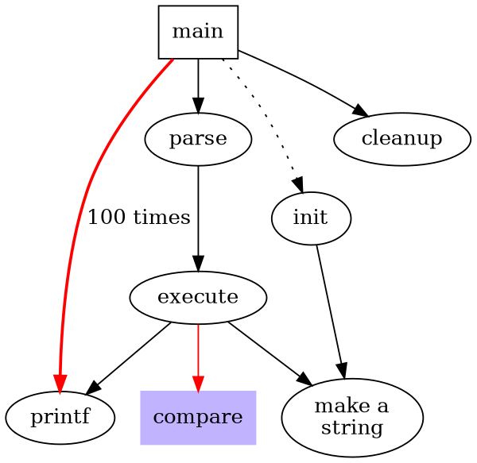
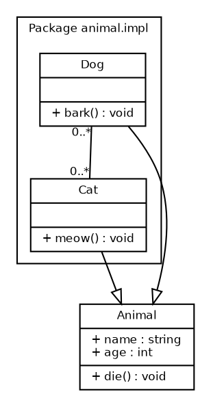
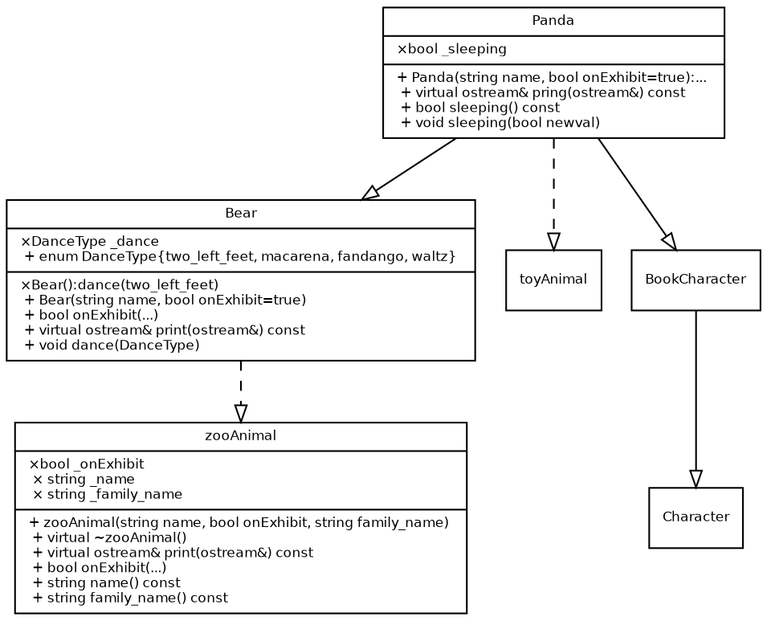

## Sample-1

## Sample-2

### Sample-3

## Reference
> https://gitlab.com/graphviz/graphviz/-/blob/main/doc/dotguide.pdf  
> http://www.ffnn.nl/pages/articles/media/uml-diagrams-using-graphviz-dot.php  
> http://www.graphviz.org   

> 1 当使用inline数学公式且公式经过GFM排版之后都在同一行 使用`$...$`符号 
> 2 当希望数学公式单独成行或者经过GFM排版之后占用多行 应当使用`$$...$$`符号 
> 3 对于表示条件概率 需要表示竖线的时候`|` 应当使用`\mid` 而不是直接在键盘上打出`|` => 容易被编辑器认为是一个md制表符 
> 4 在md引入图片的时候 不要使用`
`和`
` 在这篇文档的编辑过程中vscode的preview插件在使用了上述符号之后 导致下一段的数学公式预览显示不正常 
> 5 使用md的时候 单独的两段文字上下需要空出一行 
> 6 想要强制换行的时候 需要使用` `而不是`<enter>` 
> 7 特殊字符如果想要避免和md解析关键字冲突 应当使用``将关键字包含在内  
> 8 `

`
> 9 使用html设置图片文字环绕方式:  
    `
`  
        ``  
        `
paragraph1 around the picture
`  
        `
paragraph2 around the picture
`  
        `
paragraph3 around the picture
`  
    `
`  
